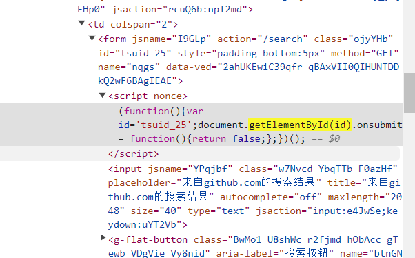
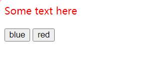

## Work a bit work of DOM
2023/10/16
### 选取的DOM例子
该接口 **getElementById()** 的方法 **Document** 返回一个对象，表示其属性与指定字符串匹配的 **Element** 元素。id由于元素 ID 在指定时必须是唯一的，因此它们是快速访问特定元素的有用方法。
例：
`getElementById(id)`
### 从网页上找的例子

### 代码示例
```
<html lang="en">
  <head>
    <title>getElementById example</title>
  </head>
  <body>
    <p id="para">Some text here</p>
    <button onclick="changeColor('blue');">blue</button>
    <button onclick="changeColor('red');">red</button>
    <script>
        function changeColor(newColor) {
        const elem = document.getElementById("para");
        elem.style.color = newColor;
        }
    </script>
  </body>
</html>
```
## 图片示例



